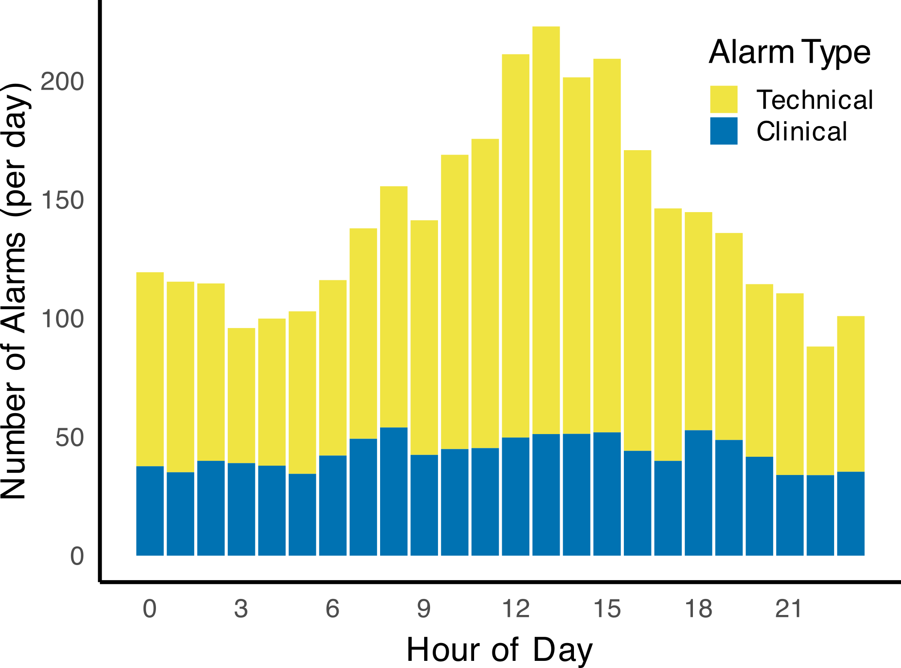
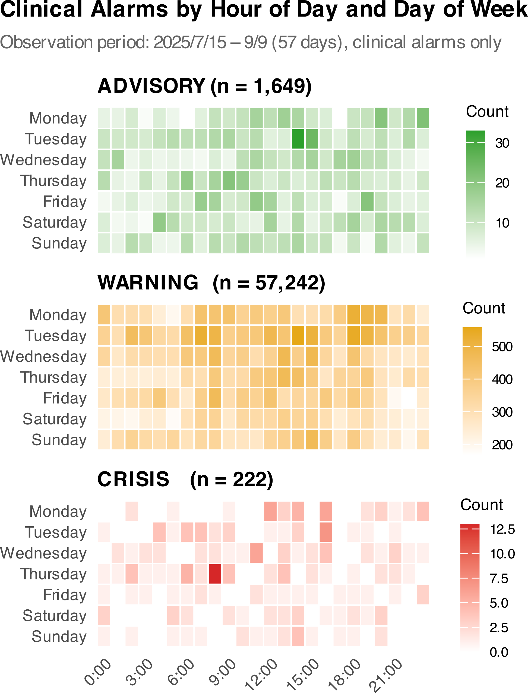
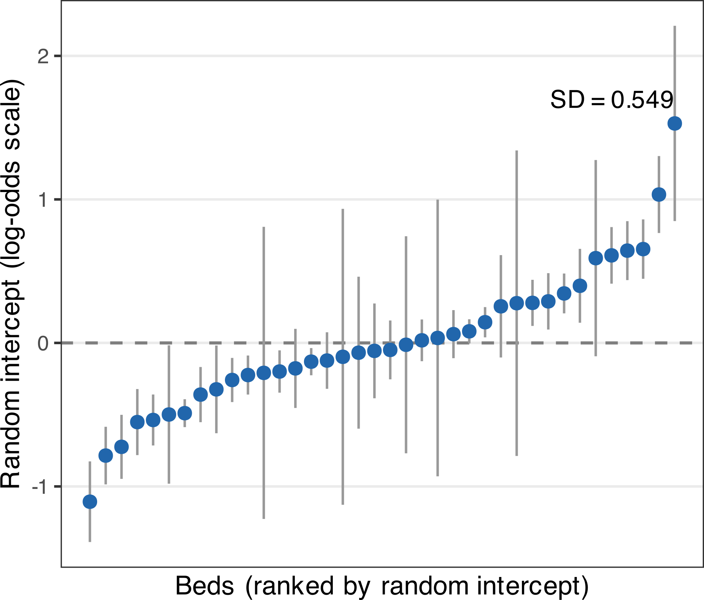
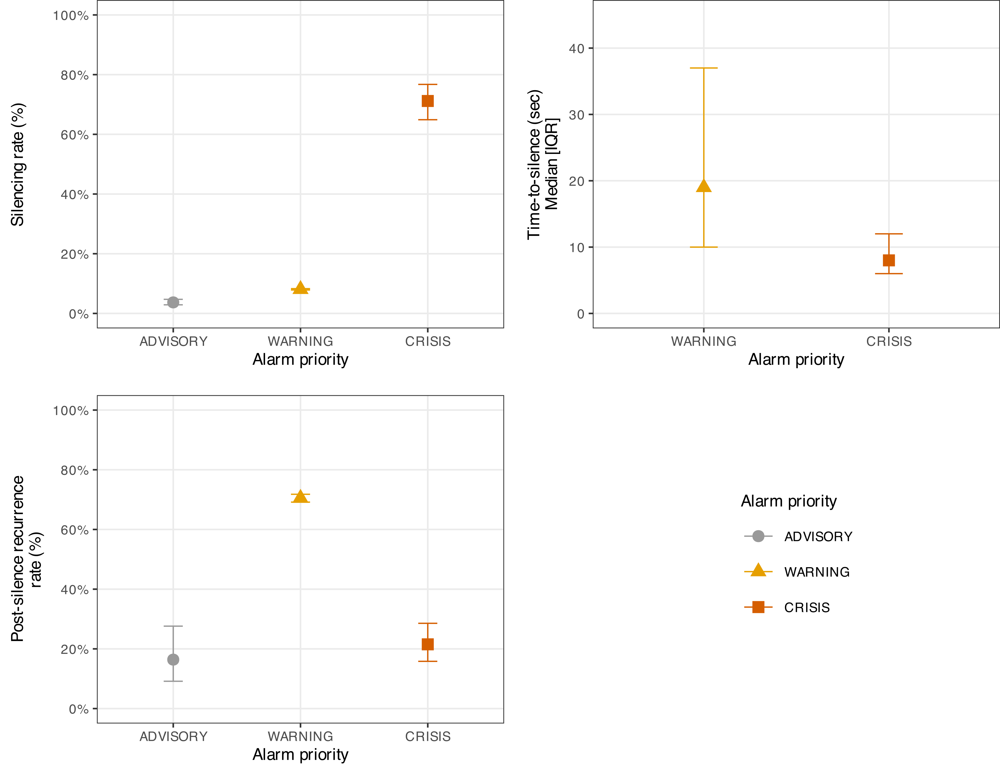
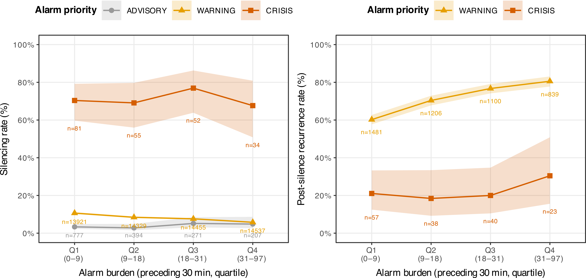

<!-- _class: lead -->

# 消化器外科病棟における生体監視モニターアラームの
# 優先度別消音行動とアラーム負荷の関連
## 高ノイズ環境下における臨床的レジリエンスの定量的評価

---

# 背景・目的

## なぜアラーム疲労が問題か

- 臨床現場では「アラームが多すぎて対応できない」状態が常態化
- 従来の対策は件数削減（総量抑制）に偏りがち
- しかし実態として看護師は全アラームに反応しているわけではない

## 研究の問い

> 膨大なノイズ下でも、看護師は**致命的なアラームへの応答を維持**できているか？

> そのメカニズムはどのように機能しているか？

## 理論的背景

- Safety-II / Resilience Engineering
- 「なぜ失敗するか」ではなく「なぜうまくいっているか」を問う
- High Reliability Organizationの視点

---

# データと方法

## データ

- **対象病棟**：外科病棟（西10・西11、モニタリング対象の計41床）
- **観察期間**：2025年7月15日〜9月9日（**57日間**）
- **総アラーム数**：193,852件
- **主解析対象**：臨床アラーム 59,113件

## アラーム分類

- **技術的アラーム**：SpO₂プローブ外れ等、臨床的意義乏しい
- **臨床的アラーム**：ADVISORY / WARNING / CRISIS の3優先度

## 主な解析

- アウトカム：消音応答の有無（silenced: YES/NO）
- 曝露変数：アラーム負荷（直前30分間の臨床アラーム件数）
- **混合ロジスティック回帰**（ベッドレベルランダム効果）

---

<!-- _class: section-divider -->

## 結果 I ── どんな環境か？

---

# Table 1A｜全アラームの特性

| 特性 | 全アラーム | 技術的 | 臨床的 |
|---|---|---|---|
| 件数 | 193,852 (100%) | **134,739 (69.5%)** | 59,113 (30.5%) |
| アラーム密度（件/床/日） | 82.9 | 57.7 | 25.3 |
| ADVISORY | 135,783 (70%) | 134,134 (99.6%) | 1,649 (2.8%) |
| WARNING | 57,847 (29.8%) | 605 (0.4%) | 57,242 (96.8%) |
| CRISIS | 222 (0.1%) | 0 (0%) | **222 (0.4%)** |
| 消音あり | 5,759 (3%) | 914 (0.7%) | 4,845 (8.2%) |
| 消音までの時間（中央値 [IQR]） | 20 [10–49] 秒 | 206 [17–3025] 秒 | 18 [10–36] 秒 |

> 全アラームの**69.5%が技術的アラーム**という高ノイズ環境。
> 技術的アラームはほぼ消音されず（0.7%）放置されている。

---

# Figure 1A｜時間帯別アラーム種別

---

# Figure 1B｜臨床アラームの時間帯×曜日パターン

---

# Table 1B｜臨床アラーム：優先度別内訳

| 特性 | ADVISORY | WARNING | CRISIS |
|---|---|---|---|
| 件数（臨床アラーム中） | 1,649 (2.8%) | 57,242 (96.8%) | **222 (0.4%)** |
| 消音あり | 61 (3.7%) | 4,626 (8.1%) | **158 (71.2%)** |
| 消音までの時間（中央値 [IQR]） | 19 [12–69] 秒 | 19 [10–37] 秒 | **8 [6–12] 秒** |
| 持続時間（中央値 [IQR]） | 18 [10–19] 秒 | 11 [4–23] 秒 | 31 [9–37] 秒 |
| 高重症ゾーン | 770 (46.7%) | 8,150 (14.2%) | 105 (47.3%) |

> CRISISは件数こそ0.4%と僅少だが、**消音率71.2%・中央値8秒**と
> 突出した応答を受けている。希少だが高反応率という逆説的指標

---

<!-- _class: section-divider -->

# 解析手法について
## 方法の説明 ── 混合ロジスティック回帰

---

# 解析手法①｜混合ロジスティック回帰：直感的な理解

## 問いを確率の問題に変換する

- 「アラームが鳴ったとき、看護師が消音する確率は？」
- アウトカムは YES(1) か NO(0) の2値 → **ロジスティック回帰**で確率を予測

## 「同じ場所のデータは似てしまう」問題

- 同じ病床の患者が重症なら、その病床のアラームは**まとめて反応されやすい**
- 1件1件が独立しているという仮定が崩れる → 偽の有意差が出やすくなる

## ランダム効果で「場所のクセ」を吸収する

> モデルが**各ベッドに補正値（ランダム切片）を自動推定**し、
> 「そのベッド固有の消音しやすさ」を差し引いた上で
> 負荷・優先度の効果を推定する → これが「**混合**」ロジスティック回帰
> ※ 観察期間中に患者は入れ替わるため、ランダム効果は患者個人ではなく**ベッド番号**を反映

---

# Figure S2｜各ベッドのランダム切片分布

*各ベッドの「消音しやすさの補正値」の実際の分布。分散 = 0.302*
*ベッドごとにばらつきがあることが確認できる。*

---

# 解析手法②｜交互作用項：「効き方の違い」を検証する

## 交互作用とは

> 「AとBが**一緒のときにだけ**現れる効果」
> この研究では：A = 負荷増加、B = 優先度の違い

**「負荷が増えたとき、WARNINGとCRISISで消音率の変化量が違うか？」**

## 帰無仮説 vs 対立仮説

| | 交互作用なし（H₀） | **交互作用あり（H₁）** |
|---|---|---|
| 負荷が増えると… | WARNING ↓・CRISIS ↓（同じ割合） | WARNING ↓・CRISIS → 変化なし |
| 意味 | スタッフが一律に疲弊 | **優先度付けが機能している** |

## 結果の読み方

- 交互作用OR = 1.00 → 負荷が増えても消音率は変わらない
- CRISISの交互作用OR = **1.00**（95%CI 0.972–1.029）→ **完全に維持**

---

# 解析手法③｜「アラーム負荷」の窓サイズ：感度分析

## 定義の恣意性をどう担保したか

- 「直前x分のアラーム件数」のxは恣意的 → 5分 / 10分 / 30分 で検証
- 結果が窓サイズに依存するなら解釈の信頼性が揺らぐ

## 感度分析の結果

| | 5分窓 | 10分窓 | **30分窓（主解析）** |
|---|---|---|---|
| WARNING × 負荷（OR） | 0.920 | 0.949 | **0.978** |
| p 値 | 0.029 | 0.014 | **0.015** |
| CRISIS × 負荷（OR） | 0.935 | 0.974 | **1.000** |
| p 値 | 0.29 | 0.47 | **0.999** |
| AIC | 31,653.7 | 31,662.1 | **31,653.3** |

> **3窓とも結果は一致**：WARNING は有意低下、CRISIS は影響なし。
> 30分窓を主解析に採用（AIC最小・病棟ラウンドの臨床的時間単位として自然）。

---

<!-- _class: section-divider -->

# 主解析結果
## 結果 II ── 負荷下での優先度別応答

---

# Figure 2｜優先度別：消音率と応答時間（静的構造）

---

# Table 2｜アラーム負荷四分位×優先度 観測消音率

| 優先度 | Q1（低負荷：0–9件） | Q2（9–18件） | Q3（18–31件） | Q4（高負荷：31–97件） |
|---|---|---|---|---|
| ADVISORY | 3.3%（n=777） | 2.8%（n=394） | 5.2%（n=271） | 4.8%（n=207） |
| WARNING | **10.6%**（n=13,921） | 8.4%（n=14,329） | 7.6%（n=14,455） | **5.8%**（n=14,537） |
| CRISIS | 70.4%（n=81） | 69.1%（n=55） | 76.9%（n=52） | 67.6%（n=34） |

> WARNINGは低負荷時10.6% → 高負荷時5.8%へ**45%相対低下**。
> CRISISは全四分位を通じて**67–77%を維持**。

---

# Figure 3｜メイン発見：負荷×優先度 交互作用プロット

---

# Table 3｜混合ロジスティック回帰結果（30分窓モデル）

| 変数 | OR | 95% CI | p値 |
|---|---|---|---|
| 優先度（ref: ADVISORY） | | | |
|　WARNING | 4.940 | 3.357–7.271 | <0.001 |
|　CRISIS | **74.842** | 40.409–138.617 | <0.001 |
| 交互作用：負荷増加あたり（ADVISORY） | 1.011 | 0.993–1.029 | 0.236 |
| 　× WARNING | **0.978** | 0.960–0.996 | 0.015 |
| 　× CRISIS | **1.000** | 0.972–1.029 | 0.999 |
| 高重症ゾーン（ref: 一般） | 1.461 | 0.971–2.198 | 0.069 |
| 夕方シフト（ref: 日勤） | 0.780 | 0.706–0.861 | <0.001 |
| 夜勤（ref: 日勤） | 1.459 | 1.365–1.560 | <0.001 |
| 週末（ref: 平日） | 1.141 | 1.065–1.222 | <0.001 |

*N = 59,113；ベッドレベル分散 0.302；AIC = 31,653.3*

> **副次的知見**：夜勤は日勤より消音率が高く（OR 1.46）、夕方は最も低い（OR 0.78）。
> 夕方は申し送り・面会・処置が重なる最繁忙帯であることが背景?

---

# 結論と臨床的意義

## 主要な発見

- 高ノイズ環境（技術的アラーム69.5%）下でも、**CRISISへの応答は維持**されていた
- 負荷増大に伴い**WARNINGを選択的に抑制**することでCRISISを守っている
- これは「見落とし」ではなく、**臨床的レジリエンス（適応能力）**の証拠

## Safety-IIの観点

> 看護師はアラーム負荷に対し、CRISISを優先的に反応するために
> 低優先度を**抑制**していた。
> アラーム管理の要諦は一律の件数削減ではなく、
> **優先度層ごとの最適化**である。

---

## Limitations

1. **消音 ≠ 臨床対応**：ボタン押下が患者評価を意味しない
2. **CRISIS件数の少なさ**：222件（silenced=158件）で統計的検出力に限界
3. **ランダム効果はロケーション**：患者個人ではなくベッドを反映

## 今後の方向性

- 論文化
- 投稿先の候補（BMJ Q&S, JAMIA 等）

